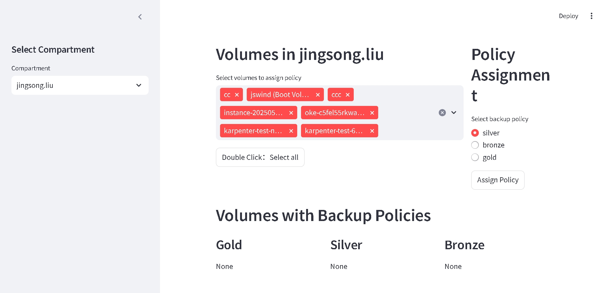

## super super backup

## run the python file with streamlit 

## streamlit run streamlit.py

## of course you need to configure api key and grant permissions

## the web page is at http://localhost:8501

## you can configure your region in head of the python file 

```
config['region']='ap-melbourne-1'
```

